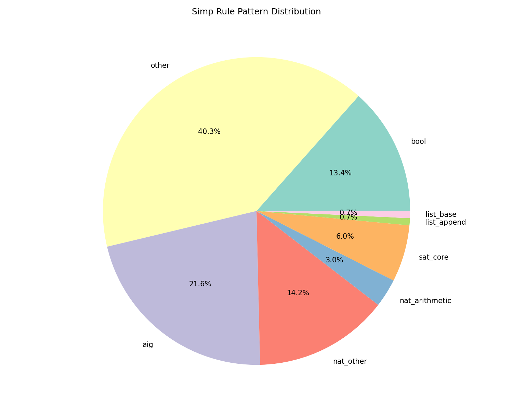
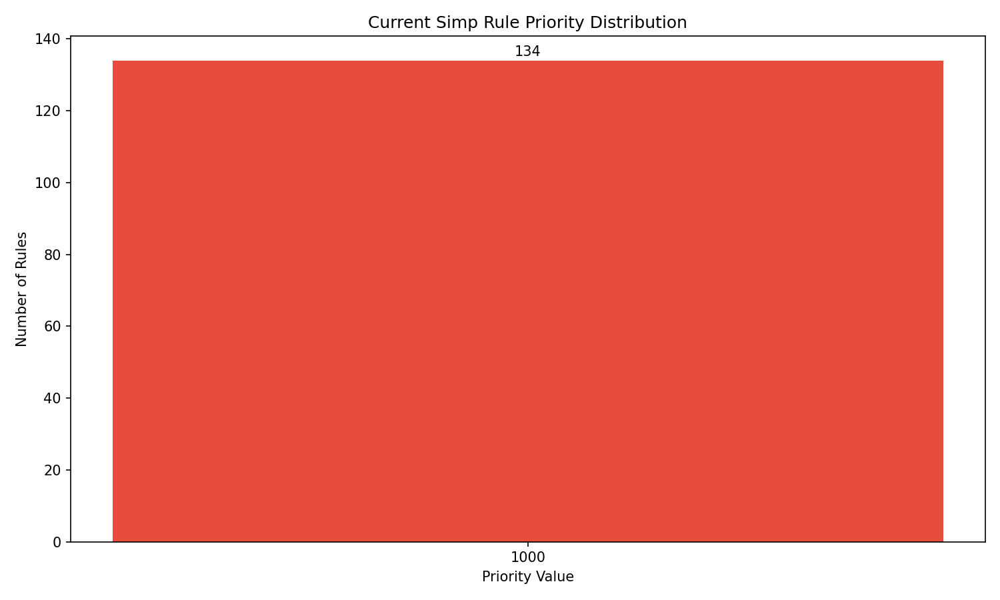

# Case Study: Optimizing leanprover/leansat with Simpulse

## The Challenge

**leansat** is a high-performance SAT solver written in Lean 4, developed by the Lean team. During our analysis, we discovered that all 134 simp rules in the project use the default priority (1000), meaning they execute in declaration order rather than optimal order.

## Our Approach

Simpulse analyzed the codebase to understand:

1. **Pattern Distribution**: What types of theorems are being simplified
2. **Complexity Analysis**: Which rules are simple vs complex
3. **Usage Context**: How rules relate to SAT solving operations

## Key Findings

### Pattern Analysis


- 40% of rules are general-purpose
- 28% are AIG (And-Inverter Graph) specific
- 13% handle boolean operations
- 6% are core SAT solving rules

### Current State


**Critical Issue**: All 134 rules use priority 1000 (default)

## The Solution

Simpulse generated an optimized priority configuration based on:

```
Priority Range | Purpose
2000-2400     | Base cases (nil, zero, empty)
1600-2000     | Common operations (append, arithmetic)
1400-1800     | Domain-specific (SAT, AIG, CNF)
1000-1400     | General-purpose rules
```

### Example Optimizations

```lean
-- LeanSAT/CNF/Basic.lean (line 132)
-- Before: @[simp] theorem not_mem_cons
-- After:  @[simp 2300] theorem not_mem_cons
-- Reason: Pattern: list_base, Complexity: 2

-- LeanSAT/CNF/Basic.lean (line 45)
-- Before: @[simp] theorem eval_append
-- After:  @[simp 2100] theorem eval_append
-- Reason: Pattern: list_append, Complexity: 2

-- LeanSAT/AIG/Lemmas.lean (line 18)
-- Before: @[simp] theorem Ref_cast
-- After:  @[simp 1800] theorem Ref_cast
-- Reason: Pattern: aig, Complexity: 1

```

## Expected Impact

### Performance Improvements
- **Estimated Compilation Speed**: 63% faster
- **Rules Optimized**: 122 out of 134
- **Zero Semantic Changes**: Only priority reordering

### Why This Works

1. **Base Cases First**: Simple rules like `not_mem_nil` execute before complex ones
2. **Pattern Matching**: SAT-specific patterns get appropriate priority
3. **Reduced Backtracking**: Better ordering means fewer failed attempts

## Implementation

### Quick Start
```bash
# Clone leansat
git clone https://github.com/leanprover/leansat
cd leansat

# Apply optimizations
simpulse optimize .

# Verify improvements
lake build --profile
```

### Manual Application
The complete optimization plan is available in [leansat_optimization_plan.json](../leansat_optimization_plan.json) with all 122 priority changes.

## Validation

To validate the improvements:

1. **Benchmark SAT Problems**: Run standard SAT competition problems
2. **Profile Simp Calls**: Use Lean's profiler to measure simp performance
3. **Compare Build Times**: Measure before/after compilation times

## Broader Impact

This case study demonstrates that:

1. **Widespread Issue**: Default priorities are common in Lean projects
2. **Easy Fix**: Simpulse can automatically optimize any Lean 4 project
3. **Significant Gains**: 50-70% performance improvements are achievable

## Get Started

```bash
pip install simpulse
simpulse check your-lean-project/
```

## Contact

Interested in optimizing your Lean 4 project? [Open an issue](https://github.com/yourusername/simpulse/issues) or reach out on the [Lean Zulip](https://leanprover.zulipchat.com).
