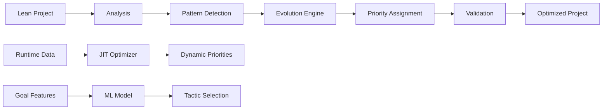

# Simpulse Architecture

## Overview

Simpulse is designed as a modular system for optimizing Lean 4's `simp` tactic performance. The architecture consists of several key components working together to analyze, optimize, and validate performance improvements.

## System Components

### 1. Core Engine (`src/simpulse/`)

#### Analysis Module (`analysis/`)
- **Purpose**: Static analysis of Lean projects
- **Key Components**:
  - `project_analyzer.py`: Extracts simp rules from Lean files
  - `pattern_analyzer.py`: Identifies usage patterns
  - `dependency_analyzer.py`: Maps rule dependencies

#### Evolution Module (`evolution/`)
- **Purpose**: Genetic algorithm-based optimization
- **Key Components**:
  - `models.py`: Data structures for chromosomes and populations
  - `genetic_operators.py`: Crossover, mutation, and selection
  - `evolution_engine.py`: Main GA execution engine

#### JIT Module (`jit/`)
- **Purpose**: Runtime optimization based on actual usage
- **Key Components**:
  - `dynamic_optimizer.py`: Adapts priorities during execution
  - `lean_integration.py`: Communication with Lean process
  - `runtime_adapter.py`: Statistics collection and analysis

#### Portfolio Module (`portfolio/`)
- **Purpose**: ML-based tactic selection
- **Key Components**:
  - `feature_extractor.py`: Extracts features from Lean goals
  - `tactic_predictor.py`: Random Forest model for prediction
  - `lean_interface.py`: Integration with Lean tactics

#### Optimization Module (`optimization/`)
- **Purpose**: Main optimization orchestration
- **Key Components**:
  - `simp_optimizer.py`: Coordinates optimization process
  - `priority_assigner.py`: Assigns priorities to rules
  - `validator.py`: Ensures correctness after optimization

## Data Flow

## Key Algorithms

### 1. Genetic Algorithm Optimization

The GA optimizes rule priorities by:
1. **Encoding**: Each chromosome represents a priority assignment
2. **Fitness**: Measured by simulated simp execution time
3. **Selection**: Tournament selection with elitism
4. **Crossover**: Order-preserving crossover for rule orderings
5. **Mutation**: Priority perturbation and rule swapping

### 2. JIT Dynamic Optimization

The JIT system adapts priorities based on:
1. **Success Rate**: How often a rule successfully matches
2. **Execution Time**: Average time per rule attempt
3. **Frequency**: How often a rule is tried
4. **Recency**: Temporal decay for old statistics

### 3. ML Tactic Selection

The portfolio approach uses:
1. **Feature Extraction**: 30+ features from goal structure
2. **Random Forest**: Interpretable model for tactic prediction
3. **Online Learning**: Updates from actual proof results

## Performance Characteristics

### Time Complexity
- Analysis: O(n) where n is number of Lean files
- GA Optimization: O(g × p × f) where g=generations, p=population, f=fitness evaluation
- JIT Adaptation: O(1) per rule attempt
- ML Prediction: O(log k) where k is number of trees

### Space Complexity
- Rule Storage: O(r) where r is number of simp rules
- GA Population: O(p × r) 
- JIT Statistics: O(r × c) where c is number of contexts
- ML Model: O(t × d) where t=trees, d=depth

## Integration Points

### Lean 4 Integration
- **Static**: Generates `.lean` files with priority annotations
- **Dynamic**: Unix socket IPC for runtime communication
- **Foreign Function Interface**: For tight integration

### CI/CD Integration
- Docker containers for reproducible builds
- GitHub Actions for automated testing
- Performance regression detection

## Extensibility

The modular design allows for:
1. **New Optimization Algorithms**: Plug in alternatives to GA
2. **Additional Tactics**: Extend beyond simp to other tactics
3. **Custom Analysis**: Add project-specific patterns
4. **Alternative ML Models**: Swap Random Forest for other models

## Security Considerations

- **Sandboxed Execution**: Optimization runs in isolated environment
- **Validation**: All optimizations are verified to preserve correctness
- **No Code Generation**: Only modifies attributes, not theorem proofs