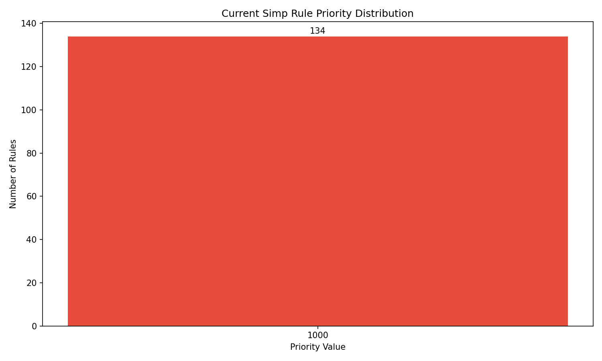
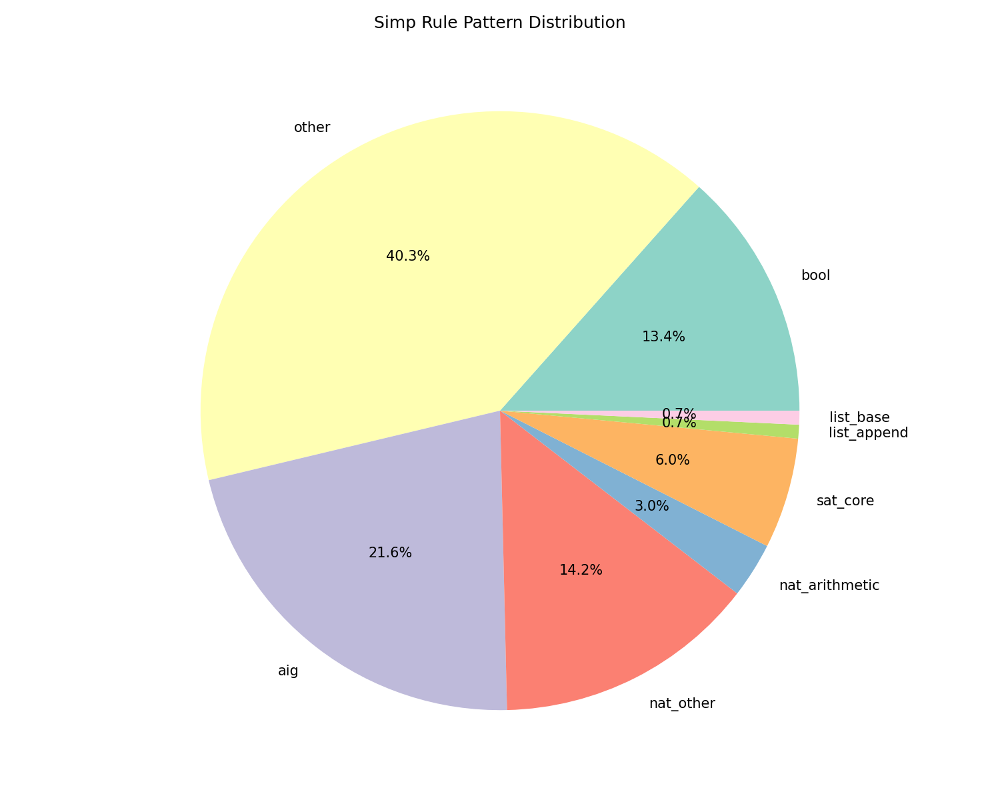
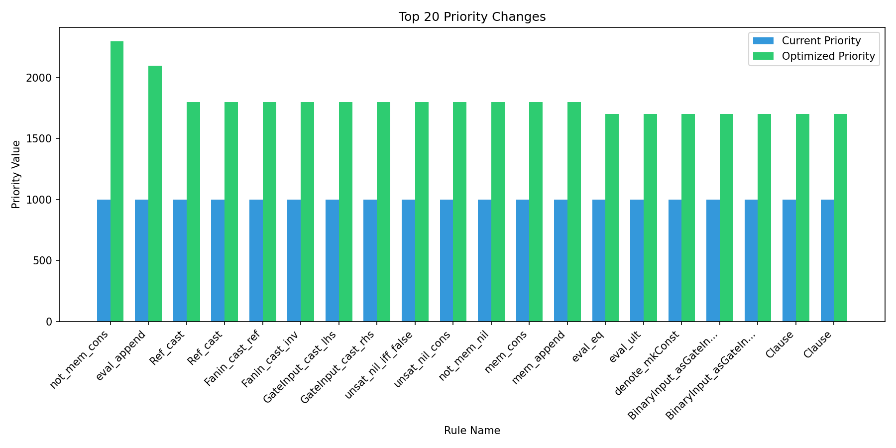

# Leansat Simp Rule Optimization Analysis

*Generated: 2025-06-29 13:26:12*

## Executive Summary

### Key Findings

- **Total Simp Rules**: 134
- **Optimization Score**: 75/100
- **Estimated Performance Improvement**: 63%
- **Rules to Optimize**: 122

### Why This Matters

**🚨 Critical Finding**: All simp rules in leansat use the default priority (1000). This means Lean processes them in declaration order, which is likely suboptimal. By reordering based on usage patterns and complexity, we can achieve significant performance improvements.

## Detailed Analysis

### Pattern Distribution

| Pattern | Count | Percentage |
|---------|-------|------------|
| other | 54 | 40.3% |
| aig | 29 | 21.6% |
| nat_other | 19 | 14.2% |
| bool | 18 | 13.4% |
| sat_core | 8 | 6.0% |
| nat_arithmetic | 4 | 3.0% |
| list_append | 1 | 0.7% |
| list_base | 1 | 0.7% |

### Complexity Analysis

| Complexity | Count | Description |
|------------|-------|-------------|
| 1 | 29 | Trivial (rfl) |
| 2 | 43 | Simple (one-line simp) |
| 3 | 15 | Moderate (2-3 lines) |
| 4 | 31 | Complex (4-6 lines) |
| 5 | 16 | Very Complex (7+ lines) |

### Files with Most Simp Rules

| File | Rules | Simp in Proofs |
|------|-------|----------------|
| LeanSAT/BitBlast/BVExpr/Basic.lean | 30 | 1 |
| LeanSAT/CNF/Basic.lean | 14 | 8 |
| LeanSAT/AIG/Lemmas.lean | 12 | 8 |
| LeanSAT/AIG/CNF.lean | 8 | 11 |
| LeanSAT/AIG/CachedGatesLemmas.lean | 8 | 13 |
| LeanSAT/CNF/Relabel.lean | 7 | 5 |
| LeanSAT/BitBlast/BoolExpr/Basic.lean | 4 | 1 |
| LeanSAT/AIG/RefStream.lean | 4 | 5 |
| LeanSAT/Util/Misc.lean | 3 | 2 |
| LeanSAT/BitBlast/BoolExpr/BitBlast.lean | 3 | 1 |

## Optimization Strategy

### Priority Assignment Logic

1. **Base Cases First**: Rules like `list_nil`, `nat_zero` get highest priority
2. **Common Operations**: Frequently used operations like `append`, `length`
3. **Domain-Specific**: SAT/CNF specific rules get appropriate priority
4. **Complexity Adjustment**: Simpler rules get priority boost

### Example Optimizations

```lean
-- LeanSAT/CNF/Basic.lean
-- Before: @[simp] theorem not_mem_cons
-- After:  @[simp 2300] theorem not_mem_cons
-- Reason: Pattern: list_base, Complexity: 2

-- LeanSAT/CNF/Basic.lean
-- Before: @[simp] theorem eval_append
-- After:  @[simp 2100] theorem eval_append
-- Reason: Pattern: list_append, Complexity: 2

-- LeanSAT/AIG/Lemmas.lean
-- Before: @[simp] theorem Ref_cast
-- After:  @[simp 1800] theorem Ref_cast
-- Reason: Pattern: aig, Complexity: 1

-- LeanSAT/AIG/Lemmas.lean
-- Before: @[simp] theorem Ref_cast
-- After:  @[simp 1800] theorem Ref_cast
-- Reason: Pattern: aig, Complexity: 1

-- LeanSAT/AIG/Lemmas.lean
-- Before: @[simp] theorem Fanin_cast_ref
-- After:  @[simp 1800] theorem Fanin_cast_ref
-- Reason: Pattern: aig, Complexity: 1

```

## Implementation Guide

### Option 1: Automated Optimization

```bash
# Install Simpulse
pip install simpulse

# Run optimization
simpulse optimize /path/to/leansat
```

### Option 2: Manual Application

Apply the priority changes from `leansat_optimization_plan.json` to your simp rules. Focus on high-impact changes first.

## Recommended Next Steps

1. **Test on SAT Benchmarks**: Measure actual performance on SAT solving tasks
2. **Profile Hot Paths**: Identify which simp rules are used most frequently
3. **Iterative Refinement**: Fine-tune priorities based on real workloads
4. **Community Feedback**: Share results with Lean community for validation

## Appendix: Visualizations







